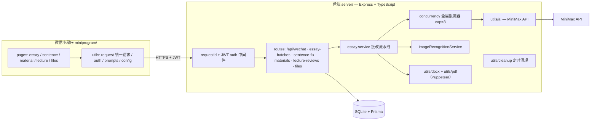

# AI 语文教学助手


面向语文老师的微信小程序 + Node.js 后端：**拍照上传 → 图片识别 → AI 批改 → Word / PDF 报告** 的批量作文批改流水线，另附病句修改、写作素材库、讲座心得等教学模块。已上线运营（体验版真机验证、云域名部署、PM2 生产守护）。

## 功能模块

| 模块 | 说明 |
|---|---|
| 作文批改 | 按学生批量上传多页作文图片，AI 识别文字后两步批改，生成 Word/PDF 报告与批次 ZIP |
| 病句修改 | 病句分析、修改、讲解、同类示例 |
| 写作素材库 | 8 大主题（成长/坚持/亲情/挫折/自信/时间/理想/观察生活）素材浏览与收藏 |
| 讲座心得 | 听讲座后生成心得报告，支持导出 |
| 文件中心 | 统一管理生成的 docx / pdf / zip 文件 |
| 账号体系 | 微信登录，JWT 鉴权，用户数据隔离 |

## 架构



### 批改流水线（两步）

1. **识别**：作文图片经 `imageRecognitionService` 提取文字
2. **批改**：`essay.service` 组装提示词调用 MiniMax，产出评分 / 短评 / 结构化结果（JSON 落库），再由 `utils/docx` 与 `utils/pdf`（Puppeteer）双格式导出

批次状态机：`pending → processing → completed | partial | failed`；单篇任务 `pending → processing → success | failed`，失败可单篇重试。

### 数据模型（Prisma / SQLite）

`User`、`EssayBatch`（批次统计计数）、`EssayTask`（识别文本 + 批改结果 + 报告 URL）、`SentenceFixRecord`、`WritingMaterial` + `MaterialFavorite`、`LectureReview`、`GeneratedFile`。

## 关键工程决策

**1. 零依赖并发限流器**（`server/src/utils/concurrency.ts`）
等价 p-limit，但自实现避免 `ERR_REQUIRE_ESM`（CJS 场景）。全模块共享单一 limiter 实例——批改启动与重试并发叠加时总并发仍不超过 cap；任务异常经 `finally` 释放信号量，绝不泄漏。默认 cap=3，由环境变量 `ESSAY_MAX_CONCURRENT` 调节。

**2. 小内存机器的生存策略**（`server/ecosystem.config.cjs`）
1.7G 内存的生产机不跑 cluster：PM2 单进程 fork + `max_memory_restart: 800M` 兜底；进程退出时显式关闭 Puppeteer 浏览器，防止 Chromium 孤儿进程吃光内存。

**3. 代理与文件服务安全**（`server/src/app.ts`）
`trust proxy` 仅在显式声明 `TRUST_PROXY` 时开启——否则任何客户端都可伪造 Host 头影响 `toPublicFileUrl`；上传目录定时清理（temp 1 天 / uploads 7 天孤儿文件），`requestId` 中间件 + pino 结构化日志实现全链路请求追踪。

## 目录结构

```
miniprogram/          微信小程序前端（pages / components / utils）
server/               Node.js 后端
  src/routes/         6 组 REST 路由（含 lecture / material 路由测试）
  src/services/       essay.service 批改流水线（含服务测试）
  src/utils/          ai / concurrency / pdf / docx / cleanup / logger / db
  prisma/schema.prisma 8 张表
  Dockerfile · docker-compose.yml · ecosystem.config.cjs (PM2)
docs/smoke-test-report.md
```

## 快速开始

```bash
# 后端
cd server
cp .env.example .env           # 填入 MINIMAX_API_KEY 等
npm install
npm run db:push                # 初始化 SQLite
npm run dev                    # http://localhost:3000

# 测试
npm test                       # vitest
```

小程序端：微信开发者工具导入 `miniprogram/`，参考 `utils/config.local.js.example` 配置本地后端地址。

## 部署

- **Docker**：`server/docker-compose.yml`
- **PM2**：`pm2 start ecosystem.config.cjs`（单进程 + 800M 内存守护 + 并发 3）

## 版本时间线

- 2026-05-28 初始版本（小程序 + 后端）
- 2026-06-02 两步批改流水线 + utils 分层
- 2026-06-08 V1.0：上线前质量提升 + OCR 关键修复
- 2026-06-13 生产加固：并发限流、PM2 内存保护、Puppeteer 降级 ^21（绕开 ESM/CJS 编译冲突）

## License

MIT
